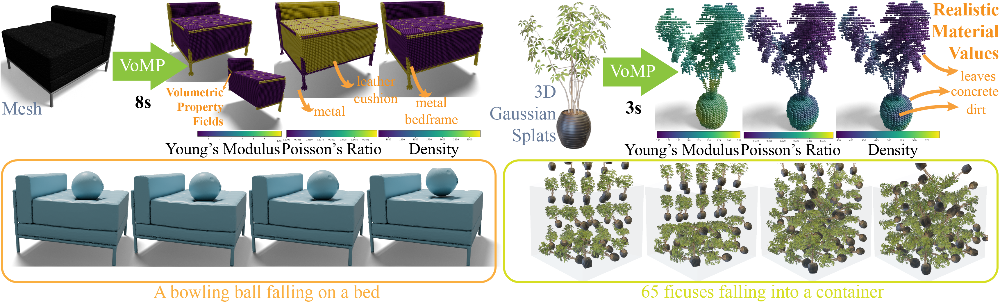
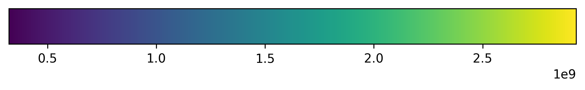

<div align="center">
<h2>VoMP: Predicting Volumetric Mechanical Properties</h2>

<a href="https://arxiv.org/abs/2510.22975"></a>
<a href='https://research.nvidia.com/labs/sil/projects/vomp/'></a>
<a href='https://huggingface.co/nvidia/PhysicalAI-Simulation-VoMP-Model'></a>
<a href='https://huggingface.co/datasets/nvidia/PhysicalAI-Robotics-PhysicalAssets-VoMP'></a>
</div>



This repository provides the implementation of **VoMP**. TL;DR: Feed-forward, fine-grained, physically based volumetric material properties from Splats, Meshes, NeRFs, etc. which can be used to produce realistic worlds. We recommend reading the [README_train.md](./README_train.md) if you need to fine-tune or train the model from scratch or know more details about the codebase.

---

## Contents

- [🔧 Dependencies and Installation](#-dependencies-and-installation)
  * [Setup a Virtual Environment (Recommended)](#setup-a-virtual-environment--recommended-)
  * [Install a Mesh Renderer (Required for Mesh Processing Only)](#install-a-mesh-renderer--required-for-mesh-processing-only-)
    + [Isaac Sim](#isaac-sim)
    + [Blender](#blender)
  * [Setup a Conda Environment (Alternative)](#setup-a-conda-environment--alternative-)
  * [Trained Models](#trained-models)
- [🌐 Quickstart: Web Demo](#-quickstart-web-demo)
- [📥 Loading the Model](#-loading-the-model)
  * [Using Inference Config (Recommended)](#using-inference-config--recommended-)
  * [Using Direct File Paths](#using-direct-file-paths)
  * [Using Directories (use for fine-tuning)](#using-directories--use-for-fine-tuning-)
- [🎯 High-Level API](#-high-level-api)
  * [Gaussian Splats](#gaussian-splats)
  * [Meshes](#meshes)
  * [USD Assets (including meshes)](#usd-assets--including-meshes-)
    + [General USD Formats](#general-usd-formats)
    + [SimReady Format USD](#simready-format-usd)
- [🎨 Visualizing Material Results](#-visualizing-material-results)
- [🔧 Low-Level API](#-low-level-api)
  * [Gaussian Splats](#gaussian-splats-1)
  * [Meshes](#meshes-1)
  * [USD Assets](#usd-assets)
- [🧩 Custom 3D Representations](#-custom-3d-representations)
- [🧬 Material Upsampler](#-material-upsampler)
- [💾 Using our Benchmark](#-using-our-benchmark)
  * [Reproducing results from the paper](#reproducing-results-from-the-paper)
- [📦 Simulation](#-simulation)
  * [Simplicits simulation](#simplicits-simulation)
  * [FEM simulation using warp.fem](#fem-simulation-using-warpfem)
  * [FEM simulation using libuipc](#fem-simulation-using-libuipc)
  * [Newton simulation](#newton-simulation)
- [🤗 Credits](#-credits)
- [📜 Citation](#-citation)
- [License and Contact](#license-and-contact)

## 🔧 Dependencies and Installation

All the instructions in this README are meant to be run from the root of the repository. Running simulations requires a separate set of dependencies than this setup which we mention later in the [📦 Simulation](#-simulation) section.

### Setup a Virtual Environment (Recommended)

First set up the environment. We recommend using Python>=3.10, PyTorch>=2.1.0, and CUDA>=11.8. It is okay if some packages show warnings or fail to install due to version conflicts. The version conflicts are not a problem for the functionalities we use.

```bash
git clone --recursive https://github.com/nv-tlabs/VoMP
cd VoMP

# Install dependencies using the provided script (Linux only)
chmod +x install_env.sh
./install_env.sh
```

> [!NOTE]
> Running install_env.sh without conda: The script includes optional conda-only steps (environment creation/activation, installing CUDA toolkit inside the env, and setting env vars). If you're using a Python `venv` and don't have conda, the script will fail when it tries to call `conda`. You can either install conda, or comment out the conda-specific lines (lines 93-115 and any `conda install` / `conda env config vars set` commands). The rest of the script relies on `pip` and standard bash commands and will work in a `venv`.

### Install a Mesh Renderer (Required for Mesh Processing Only)

We only need a mesh renderer so you can download any one of Isaac Sim or Blender. There is no need to install both.

#### Isaac Sim

For mesh material estimation, you need to install Isaac Sim or Blender manually. *This is not required for Gaussian splat processing.*

Download Isaac Sim from [here](https://docs.isaacsim.omniverse.nvidia.com/5.0.0/installation/index.html) and follow the instructions to install it. On Linux, you would have a `isaac-sim.sh` file in the path you installed it. For Windows, you would have a `isaac-sim.bat` file in the path you installed it. Note the path to the `isaac-sim.sh` or `isaac-sim.bat` file.

> [!NOTE]
> You'll need to provide the Isaac Sim binary path when using mesh APIs.

> [!WARNING]
> We use Replicator in Isaac Sim to render meshes. Replicator supports USD assets. If you want to use a USD asset, since USD files can contain many things in many formats we expect you to have used [existing tools](https://openusd.org/release/toolset.html) to convert it into an explicit mesh. If you want to use a mesh asset, you can use Replicator by also having a USD file of your mesh that you can make by using [existing tools](https://openusd.org/release/toolset.html).  

#### Blender

For mesh material estimation, you need to install Blender 3.0+ manually. *This is not required for Gaussian splat processing.*

```bash
# Install system dependencies
sudo apt-get update
sudo apt-get install -y libxrender1 libxi6 libxkbcommon-x11-0 libsm6

# Download and install Blender 3.0.1
wget https://download.blender.org/release/Blender3.0/blender-3.0.1-linux-x64.tar.xz
tar -xvf blender-3.0.1-linux-x64.tar.xz

# Note the path: ./blender-3.0.1-linux-x64/blender
```

> [!NOTE]
> You'll need to provide the Blender binary path when using mesh APIs:
> ```python
> results = model.get_mesh_materials("mesh.obj", blender_path="/path/to/blender")
> ```

### Setup a Conda Environment (Alternative)

We also provide a conda environment file to install the dependencies. This automatically creates a new environment:

```bash
# Create and install environment from file (creates 'vomp' environment)
conda env create -f environment.yml

# Activate the environment
conda activate vomp
```

> [!WARNING]
> We do not recommend using this installation method. The conda environment file is accurate but it reflects the environment at its final stage and does not have the step-by-step process we use to install the dependencies.

### Trained Models

We provide the trained models (1.73 GB) in <a href='https://huggingface.co/nvidia/PhysicalAI-Simulation-VoMP-Model'></a>. Download the models and place them in the `weights/` directory. The checkpoints we will use are the `weights/matvae.safetensors` and `weights/geometry_transformer.pt` files.

The above two files from the model repository contains the final checkpoint of the model. If you need to fine-tune the model, you can follow the same process but download the `ft` directory from the HuggingFace repo too and place them in the `weights/` directory.

| **File** | **Model** |
|------|----------------|
| `matvae.safetensors` | MatVAE |
| `geometry_transformer.pt` | Geometry Transformer |
| `normalization_params.json` | Normalization Parameters |
| `inference.json` | Inference Configuration |
| `ft` | MatVAE and Geometry Transformer checkpoints (same as above but in a directory structure compatible for fine-tuning) |

## 🌐 Quickstart: Web Demo

We provide a simple web demo to quickly test out VoMP in a GUI. The web-demo uses some additional dependecies over the base environment, see [`gradio/requirements.txt`](./gradio/requirements.txt). To start the web demo, run:

```bash
python gradio/app.py
```

Then, you can access the demo at the address shown in the terminal. The web demo allows you to run the model, visualize the outputs of the model and download an artifact which can directly be used for [📦 Simulation](#-simulation).

## 📥 Loading the Model

Before using any of the VoMP APIs, you need to load the model. We provide flexible loading options:

### Using Inference Config (Recommended)

The simplest way to load the model is using the inference configuration file:

```python
from vomp.inference import Vomp

# Load model using inference config (recommended - uses final_ckpt.zip weights)
model = Vomp.from_checkpoint(
    config_path="weights/inference.json",
    use_trt=False # Set to True to enable TensorRT acceleration (significantly faster but requires `torch-tensorrt`)
)
```

> [!NOTE]
> Using the `use_trt` flag will compile the DINO model with TensorRT. This makes the `from_checkpoint` function slower.

### Using Direct File Paths

For more control, you can specify exact checkpoint files, optionally overriding the inference config:

```python
# Load model using direct file paths
model = Vomp.from_checkpoint(
    config_path="weights/inference.json",
    geometry_checkpoint_dir="weights/geometry_transformer.pt",
    matvae_checkpoint_dir="weights/matvae.safetensors",
    normalization_params_path="weights/normalization_params.json"
)

# Or override specific paths from inference config
model = Vomp.from_checkpoint(
    config_path="configs/materials/inference.json",
    geometry_checkpoint_dir="custom/path/to/geometry_transformer.pt"  # Override just this path
)
```

### Using Directories (use for fine-tuning)

Use this approach only if you are using the fine-tuning checkpoints i.e. the `ft/` directory in the model repository. This lets the model auto-find the latest checkpoints:

```python
from vomp.inference import Vomp

# Load model using directories (auto-finds latest checkpoints)
model = Vomp.from_checkpoint(
    config_path="weights/inference.json",
    geometry_checkpoint_dir="weights/ft/geometry_transformer",
    matvae_checkpoint_dir="weights/ft/matvae", 
    normalization_params_path="weights/ft/matvae/normalization_params.json",
    geometry_ckpt="latest"  # Can also be a specific step number
)
```

We provide a flexible Python API with both high-level and low-level interfaces for material property estimation.

## 🎯 High-Level API

### Gaussian Splats

For Gaussian splats, use the high-level API for the easiest experience (see [Loading the Model](#-loading-the-model) section first):

```python
from vomp.inference.utils import save_materials

# Get materials directly from PLY (auto-handles Gaussian loading)
# By default, returns materials evaluated at each Gaussian splat center
results = model.get_splat_materials("path/to/your/gaussian_splat.ply")

# Or use Kaolin voxelizer for more accurate results
# results = model.get_splat_materials("path/to/your/gaussian_splat.ply", voxel_method="kaolin")

# Control where materials are evaluated using query_points:
# results = model.get_splat_materials("path/to/your/gaussian_splat.ply", query_points="splat_centers")  # Default
# results = model.get_splat_materials("path/to/your/gaussian_splat.ply", query_points="voxel_centers")   # Voxel centers (direct output of the model)
# results = model.get_splat_materials("path/to/your/gaussian_splat.ply", query_points=custom_points)     # Custom (N,3) array

# Adjust DINO batch size for performance (higher values use more GPU memory)
# results = model.get_splat_materials("path/to/your/gaussian_splat.ply", dino_batch_size=32)

# Save results
save_materials(results, "materials.npz")
```

### Meshes

For mesh objects, use the equivalent high-level mesh API (see [Loading the Model](#-loading-the-model) section first):

```python
from vomp.inference.utils import save_materials

# Get materials directly from mesh file (supports OBJ, PLY, STL, USD)
# By default, returns materials evaluated at each mesh vertex (not recommended if you have vertices only on the surface)
# Note: Requires Blender installation (see Dependencies section)
results = model.get_mesh_materials(
    "path/to/your/mesh.obj",
    blender_path="/tmp/blender-3.0.1-linux-x64/blender"  # Adjust path as needed
)

# Control where materials are evaluated using query_points:
# results = model.get_mesh_materials("path/to/your/mesh.obj", query_points="mesh_vertices")  # Default
# results = model.get_mesh_materials("path/to/your/mesh.obj", query_points="voxel_centers")  # Voxel centers (direct output of the model)
# results = model.get_mesh_materials("path/to/your/mesh.obj", query_points=custom_points)    # Custom (N,3) array

# Use parallel rendering and adjust DINO batch size for better performance
# results = model.get_mesh_materials("path/to/your/mesh.obj", num_render_jobs=4, dino_batch_size=32, blender_path="/path/to/blender")

# Save results
save_materials(results, "materials.npz")
```

### USD Assets (including meshes)

USD files can come in many different formats with varying internal structures, materials, and organization. For USD assets, use the high-level USD API (see [Loading the Model](#-loading-the-model) section first):

#### General USD Formats

For USD files in any format, use [Isaac Sim Replicator](https://docs.isaacsim.omniverse.nvidia.com/5.1.0/replicator_tutorials/index.html) rendering with a separate mesh file for voxelization:

```python
from vomp.inference.utils import save_materials

# For general USD files - requires Isaac Sim and separate mesh
# Note: Requires Isaac Sim installation and a separate mesh file for voxelization
# Isaac Sim renders the USD while the mesh is used for voxelization
results = model.get_usd_materials(
    usd_path="path/to/your/model.usd",
    mesh_path="path/to/your/model.ply",  # Mesh for voxelization (doesn't need to be normalized)
    isaac_sim_path="~/isaac-sim/isaac-sim.sh",  # Or set ISAAC_SIM_PATH environment variable
    render_mode="path_tracing"  # Options: "fast" or "path_tracing"
)

# Control where materials are evaluated using query_points:
# results = model.get_usd_materials(..., query_points="voxel_centers")  # Default (direct output)
# results = model.get_usd_materials(..., query_points=custom_points)    # Custom (N,3) array

# Adjust DINO batch size for performance (higher values use more GPU memory):
# results = model.get_usd_materials(..., dino_batch_size=32)

# Save results
save_materials(results, "materials.npz")
```

Isaac Sim Replicator provides flexible rendering modes:

```python
# Option 1: Fast Mode - Real-time ray tracing
results = model.get_usd_materials(
    usd_path="model.usd",
    mesh_path="model.ply",
    isaac_sim_path="~/isaac-sim/isaac-sim.sh",
    render_mode="fast"  # Real-time ray tracing
)

# Option 2: Path Tracing - Higher quality
results = model.get_usd_materials(
    usd_path="model.usd",
    mesh_path="model.ply",
    isaac_sim_path="~/isaac-sim/isaac-sim.sh",
    render_mode="path_tracing"  # 256 spp, 8 bounces, denoising enabled
)

# Option 3: start from a setting and override some RTX settings
from vomp.inference import RTX_PRESETS
print(RTX_PRESETS.keys())  # See available presets: ['fast', 'path_tracing']

results = model.get_usd_materials(
    usd_path="model.usd",
    mesh_path="model.ply",
    isaac_sim_path="~/isaac-sim/isaac-sim.sh",
    render_mode="path_tracing",
    rtx_settings_override={
        # Enable path tracing renderer
        "/rtx/rendermode": "PathTracing",
        
        # Path tracing quality settings
        "/rtx/pathtracing/spp": 256,  # Samples per pixel (higher = better quality, slower)
        "/rtx/pathtracing/totalSpp": 256,  # Total samples per pixel
        "/rtx/pathtracing/maxBounces": 8,  # Maximum light bounces
        "/rtx/pathtracing/maxSpecularAndTransmissionBounces": 8,
        
        # Additional quality settings
        "/rtx/pathtracing/fireflyFilter/enable": True,  # Reduce fireflies (bright pixels)
        "/rtx/pathtracing/optixDenoiser/enabled": True,  # Enable denoiser for clean renders

        # ... other RTX settings you want to override
    }
)
```

> [!WARNING]
> Please do not override the following RTX settings, as they are required for the model to work correctly:
> - "/rtx/post/backgroundZeroAlpha/enabled": True,
> - "/rtx/post/backgroundZeroAlpha/backgroundComposite": False,
> - "/rtx/post/backgroundZeroAlpha/outputAlphaInComposite": True,

#### SimReady Format USD

If your USD file is in the **SimReady format** (like the USD files in our dataset), you can use the following arguments:

```python
from vomp.inference.utils import save_materials

results = model.get_usd_materials(
    usd_path="model.usd",
    use_simready_usd_format=True,
    blender_path="/path/to/blender",
    seed=42
)

# Control where materials are evaluated using query_points:
# results = model.get_usd_materials(..., query_points="voxel_centers")  # Default (direct output)
# results = model.get_usd_materials(..., query_points=custom_points)    # Custom (N,3) array

# Save results
save_materials(results, "materials.npz")
```

## 🎨 Visualizing Material Results

After estimating material properties, you can visualize them using our interactive `polyscope`-based viewer.

```python
# After getting results from any API
from vomp.inference.utils import save_materials

# Save your results
save_materials(results, "my_materials.npz")
```

```bash
# Launch interactive property viewer
python scripts/viewer.py my_materials.npz
```

The viewer also saves the colorbars for visualizations as PNG images that look like this:



## 🔧 Low-Level API

### Gaussian Splats

For fine-grained control with Gaussian splats, use the low-level API (see [Loading the Model](#-loading-the-model) section first):

```python
from vomp.representations.gaussian import Gaussian
from vomp.inference.utils import save_materials

# Load Gaussian splat
gaussian = Gaussian(sh_degree=3, aabb=[-1,-1,-1,2,2,2], device="cuda")
gaussian.load_ply("path/to/your/gaussian_splat.ply")

# Step-by-step pipeline
output_dir = "outputs/materials"
renders_metadata = model.render_sampled_views(gaussian, output_dir, num_views=150)
voxel_centers = model._voxelize_gaussian(gaussian, output_dir)
coords, features = model._extract_dino_features(output_dir, voxel_centers, renders_metadata, save_features=True)
results = model.predict_materials(coords, features)
save_materials(results, "materials.npz")
```

### Meshes

For fine-grained control with meshes, use the equivalent low-level mesh API (see [Loading the Model](#-loading-the-model) section first):

```python
from vomp.inference.utils import save_materials

# Step-by-step pipeline for meshes
output_dir = "outputs/materials"
mesh_path = "path/to/your/mesh.obj"
blender_path = "/tmp/blender-3.0.1-linux-x64/blender"  # Adjust for your installation
renders_metadata = model.render_mesh_views(mesh_path, output_dir, num_views=150, blender_path=blender_path)
voxel_centers = model._voxelize_mesh(mesh_path, output_dir)
coords, features = model._extract_dino_features(output_dir, voxel_centers, renders_metadata, save_features=True)
results = model.predict_materials(coords, features)
save_materials(results, "materials.npz")
```

### USD Assets

For fine-grained control with USD assets using Replicator rendering (see [Loading the Model](#-loading-the-model) section first):

```python
from vomp.inference.utils import save_materials

# Step-by-step pipeline for USD assets with Replicator
output_dir = "outputs/materials"
usd_path = "path/to/your/model.usd"
mesh_path = "path/to/your/model.ply"  # For voxelization
isaac_sim_path = "~/isaac-sim/isaac-sim.sh"

# Render using Replicator (with custom settings)
renders_metadata = model.render_views_replicator(
    asset_path=usd_path,
    output_dir=output_dir,
    num_views=150,
    isaac_sim_path=isaac_sim_path,
    render_mode="path_tracing",  # or "fast"
    rtx_settings_override={
        "/rtx/pathtracing/spp": 512  # Optional: custom settings
    }
)

# Voxelize and extract features
voxel_centers = model._voxelize_mesh(mesh_path, output_dir)
coords, features = model._extract_dino_features(output_dir, voxel_centers, renders_metadata, save_features=True)
results = model.predict_materials(coords, features)
save_materials(results, "materials.npz")
```

## 🧩 Custom 3D Representations

Bring your own 3D representation with custom render/voxelize functions (see [Loading the Model](#-loading-the-model) section first):

```python
from vomp.inference.utils import save_materials

def my_render_func(obj, output_dir, num_views, image_size, **kwargs):
    # Your rendering code here - save images to output_dir/renders/
    frames_metadata = []
    for i in range(num_views):
        # Your custom rendering logic
        frames_metadata.append({
            "file_path": f"frame_{i:04d}.png",
            "transform_matrix": camera_matrix.tolist(),  # 4x4 matrix
            "camera_angle_x": fov_radians
        })
    return frames_metadata

def my_voxelize_func(obj, output_dir, **kwargs):
    # Your voxelization code here
    voxel_centers = your_voxelization_method(obj)  # (N, 3) array
    return voxel_centers

# Use with any 3D representation
coords, features = model.get_features(
    obj_3d=your_mesh,
    render_func=my_render_func,
    voxelize_func=my_voxelize_func,
    num_views=150
)

# Get materials
results = model.predict_materials(coords, features)
save_materials(results, "materials.npz")
```

## 🧬 Material Upsampler

The high-level splat API (`get_splat_materials`) automatically returns materials interpolated to splat centers. However, you may want to upsample materials to other locations like higher resolution grids or custom query points. We provide a utility class for these cases (see [Loading the Model](#-loading-the-model) section first).

```python
import numpy as np
from vomp.inference.utils import MaterialUpsampler
from vomp.representations.gaussian import Gaussian

# Get voxel-level materials (needed for upsampling to custom locations)
# Note: Use query_points="voxel_centers" to get voxel-level results
voxel_results = model.get_splat_materials("path/to/your/gaussian_splat.ply", query_points="voxel_centers")
# OR for meshes 
# voxel_results = model.get_mesh_materials("path/to/your/mesh.obj", query_points="voxel_centers", blender_path="/path/to/blender")

# Create upsampler from voxel-level results
upsampler = MaterialUpsampler(
    voxel_coords=voxel_results["voxel_coords_world"],
    voxel_materials=np.column_stack([
        voxel_results["youngs_modulus"],
        voxel_results["poisson_ratio"], 
        voxel_results["density"]
    ])
)

# Example 1: Interpolate to Gaussian centers manually (usually not needed - high-level API does this)
gaussian = Gaussian(sh_degree=3, aabb=[-1,-1,-1,2,2,2], device="cuda")
gaussian.load_ply("path/to/your/gaussian_splat.ply")
gaussian_materials, gaussian_distances = upsampler.interpolate_to_gaussians(gaussian)

# Example 2: Interpolate to higher resolution grid (128x128x128) - main use case for manual upsampling
x = np.linspace(-0.5, 0.5, 128)
xx, yy, zz = np.meshgrid(x, x, x)
high_res_points = np.column_stack([xx.ravel(), yy.ravel(), zz.ravel()])
high_res_materials, high_res_distances = upsampler.interpolate(high_res_points)

# Example 3: Interpolate to custom query points - another main use case for manual upsampling
query_points = np.random.uniform(-0.4, 0.4, size=(1000, 3))
query_materials, query_distances = upsampler.interpolate(query_points)

# Save results
upsampler.save_results(gaussian.get_xyz.detach().cpu().numpy(), gaussian_materials, 
                      gaussian_distances, "gaussian_materials.npz")
upsampler.save_results(high_res_points, high_res_materials, high_res_distances, "high_res_materials.npz")
upsampler.save_results(query_points, query_materials, query_distances, "custom_materials.npz")
```

## 💾 Using our Benchmark 

> [!NOTE]
> Due to licenses we are unable to make the vegetation subset of the dataset public. Thus, when you compare outputs to the paper make sure to compare them to the listed results on the "public dataset" (Table 2 and Table 3).

We provide a dataset and a benchmark with fine-grained volumetric mechanical properties (65.9 GB) at <a href='https://huggingface.co/datasets/nvidia/PhysicalAI-Robotics-PhysicalAssets-VoMP'></a> (or preprocess it yourself using the instructions in [README_train.md](./README_train.md)). We also provide code allowing the evaluation of models on this dataset.

### Reproducing results from the paper

Since our dataset is quite large, we provide a way to download only the test set by running the following command:

```bash
huggingface-cli download nvidia/PhysicalAI-Robotics-PhysicalAssets-VoMP-Eval --repo-type dataset --local-dir datasets/simready
```

We can now run VoMP on the test set:

```bash
python scripts/evaluate_geometry_encoder.py \
    --config weights/inference.json \ # replace with your own config file
    --checkpoint_dir weights/ft/geometry_transformer \ # replace with your own checkpoint directory
    --data_dir datasets/simready \ # replace with your own data directory
    # --ckpt latest \
    # --results
```

This script requires loading the model in the ["Using Directories" method](#using-directories).

This prints out many detailed metrics. Particularly, you can also make sure you can reproduce the main results from the paper by comparing Table 2 and Appendix Table 3 from the paper with the outputs from Section 5 (SUMMARY TABLES) of the results printed out.

To build on top of our benchmark, you can replace the `load_model` and `evaluate_model` functions in the `scripts/evaluate_geometry_encoder.py` script with your own model and evaluation code.

## 📦 Simulation

Our properties are compatible with all simulators. We provide instructions to run a few kinds of simulations with the properties.

### Simplicits simulation

For the large-scale simulations that we perform with [Simplicits](https://research.nvidia.com/labs/toronto-ai/simplicits/), refer to the [Simplicits](https://kaolin.readthedocs.io/en/latest/notes/simplicits.html) documentation.

### FEM simulation using warp.fem

We provide a way to run FEM simulations using [`warp.fem`](https://nvidia.github.io/warp/modules/fem.html).

```bash
cd simulation/warp.fem
PYTHONPATH=./ python drop_tetmesh.py --mesh assets/cube_res20.msh --materials assets/cube_materials_two_halves.npz 
```

This simple example has an artificially constructed NPZ file which can be used in `warp.fem`. This requires installing [`warp`](https://nvidia.github.io/warp/) and `meshio`.

### FEM simulation using libuipc

We provide a way to run FEM simulations using [`libuipc`](https://github.com/spiriMirror/libuipc/). These simulations use the config files in the `configs/sim/` directory and they can be run as,

```bash
python vomp/sim/main.py configs/sim/falling_oranges.json
```

This config runs a simulation of falling oranges (Figure 5 from the paper) with the NPZ files we generated from the VoMP model.

These simulations require a `.npz` file with the estimated mechanical properties of the object. This requires installing the Python version of `libuipc` using the instructions in the [`libuipc`](https://github.com/spiriMirror/libuipc/) repository. The command above will run the simulation, show it in a GUI, and save framewise surface meshes in the `outputs/simulation_output/falling_oranges` directory. The config also specifies a visual textured surface mesh so the per frame visualizations will use the high resolution visual mesh and also have textures.

### Newton simulation

We provide a way to run [Newton](https://github.com/newton-physics/newton/) simulations. Run an example simulation of a soft body cube with the NPZ files we generated from the VoMP model by running the following command:

```bash
cd simulation/newton
python mesh_falling_sim.py --grid_dim 16 --materials cube_high_E.npz
python mesh_falling_sim.py --grid_dim 16 --materials cube_low_E.npz
```

This simple example has two artificially constructed NPZ files which can be used in Newton. Observe the difference in simulation showing all Young's modulus, Poisson's ratio, and density values were properly applied. This requires installing [`newton`](https://github.com/newton-physics/newton/) and `meshio`.

> [!NOTE]
> Our properties are also compatible with [PhysX](https://developer.nvidia.com/physx-sdk) and rigid-body simulators. We plan to release some example code to do so at a later date. Until then, if you want to use our properties in PhysX, we recommend clustering the properties we produce, split the underlying meshes based on the clusters, and then add the averaged property for each such "connected part".

## 🤗 Credits

We are also grateful to several other open-source repositories that we drew inspiration from or built upon during the development of our pipeline:

- [DINOv2](https://github.com/facebookresearch/dinov2)
- [fTetWild](https://github.com/wildmeshing/fTetWild)
- [gaussian-splatting](https://github.com/graphdeco-inria/gaussian-splatting)
- [Isaac Sim](https://developer.nvidia.com/isaac/sim)
- [kaolin](https://github.com/NVIDIAGameWorks/kaolin)
- [libuipc](https://github.com/spiriMirror/libuipc)
- [newton](https://github.com/newton-physics/newton)
- [Simplicits](https://research.nvidia.com/labs/toronto-ai/simplicits/)
- [textgrad](https://github.com/zou-group/textgrad)
- [TRELLIS](https://github.com/microsoft/TRELLIS)
- [Warp](https://nvidia.github.io/warp/)

## 📜 Citation

If you find VoMP helpful, please consider citing:

```bibtex
@inproceedings{dagli2026vomp,
    title={Vo{MP}: Predicting Volumetric Mechanical Property Fields},
    author={Rishit Dagli and Donglai Xiang and Vismay Modi and Charles Loop and Clement Fuji Tsang and Anka He Chen and Anita Hu and Gavriel State and David Levin I.W. and Maria Shugrina},
    booktitle={The Fourteenth International Conference on Learning Representations},
    year={2026},
url={https://openreview.net/forum?id=aTP1IM6alo}
}
```

## License and Contact

This project will download and install additional third-party open source software projects. Review the license terms of these open source projects before use.

VoMP source code is released under the [Apache 2 License](https://www.apache.org/licenses/LICENSE-2.0).

VoMP models are released under the [NVIDIA Open Model License](https://www.nvidia.com/en-us/agreements/enterprise-software/nvidia-open-model-license). For a custom license, please visit our website and submit the form: [NVIDIA Research Licensing](https://www.nvidia.com/en-us/research/inquiries/).