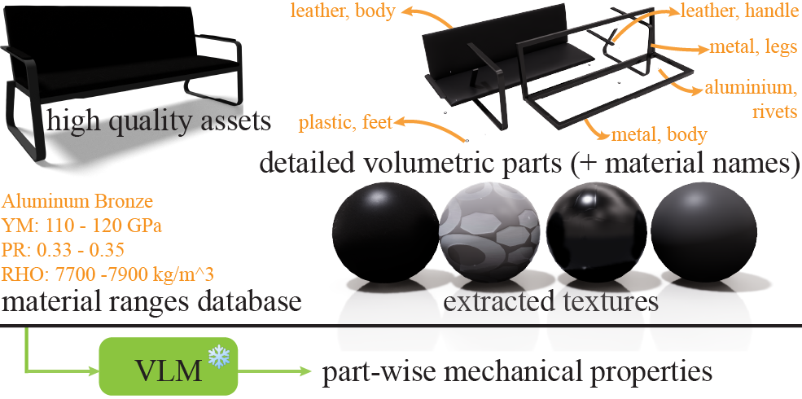

<div align="center">
<h2>VoMP: Predicting Volumetric Mechanical Properties</h2>

<a href="https://arxiv.org/abs/2510.22975"></a>
<a href='https://research.nvidia.com/labs/sil/projects/vomp/'></a>
<a href='https://huggingface.co/nvidia/PhysicalAI-Simulation-VoMP-Model'></a>
<a href='https://huggingface.co/datasets/nvidia/PhysicalAI-Robotics-PhysicalAssets-VoMP'></a>
</div>


This repository provides the implementation of **VoMP**. TL;DR: Feed-forward, fine-grained, physically based volumetric material properties from Splats, Meshes, NeRFs, etc. which can be used to produce realistic worlds.

---

## Contents

- [🔧 Setup](#-setup)
- [📖 Overview of the codebase](#-overview-of-the-codebase)
- [📚 Create the dataset](#-create-the-dataset)
  * [Preprocessed Datasets](#preprocessed-datasets)
  * [Material Triplet Dataset (MTD)](#material-triplet-dataset--mtd-)
  * [Geometry with Volumetric Materials (GVM)](#geometry-with-volumetric-materials--gvm-)
  * [Preparing your own data for training the Geometry Transformer](#preparing-your-own-data-for-training-the-geometry-transformer)
- [💻 Training](#-training)
  * [Training the MatVAE](#training-the-matvae)
  * [Training the Geometry Transformer](#training-the-geometry-transformer)
  * [Training on your own data](#training-on-your-own-data)
  * [Fine-tuning](#fine-tuning)
- [💡 Tips](#-tips)

## 🔧 Setup

Follow the instructions in the [README.md](./README.md) file to set up the environment.

## 📖 Overview of the codebase


The codebase is organized as follows:

- `train_material_vae.py`: Main entry point for training the MatVAE.
- `train_geometry_encoder.py`: Main entry point for training the Geometry Transformer.
- `vomp/`: Main Python package containing all models and utilities.
  - `models/`: Neural network architectures including MatVAE and Geometry Transformer.
    - `geometry_encoder.py`: Geometry Transformer encoder.
    - `material_vae/`: MatVAE model implementations.
    - `structured_latent_vae/`: Structured latent VAE components.
  - `trainers/`: Training frameworks for different model types.
  - `modules/`: Neural network layer classes (sparse transformers, attention, etc.).
  - `datasets/`: Dataset loaders (`SparseVoxelMaterials`, etc.).
  - `representations/`: 3D representation handlers (Gaussian splats).
  - `inference/`: Inference pipeline (`vomp.py`) and utilities.
  - `utils/`: General utility functions and data processing tools.
- `dataset_toolkits/`: Tools for dataset creation and preprocessing.
  - `material_objects/`: Material property rendering, voxelization, and VLM annotation tools.
  - `datasets/`: Dataset loaders (simready, ABO, etc.).
- `configs/`: Configuration files for different experiments.
  - `materials/`: MatVAE and Geometry Transformer configurations.
- `scripts/`: Visualization and evaluation scripts.
- `weights/`: Directory for storing pretrained model weights.

## 📚 Create the dataset

We provide toolkits for data preparation.



### Preprocessed Datasets

We provide the preprocessed datasets (with the vegetation subset removed) at: <a href='https://huggingface.co/datasets/nvidia/PhysicalAI-Robotics-PhysicalAssets-VoMP'></a>. We are unable to make the MTD dataset public due to licenses.

### Material Triplet Dataset (MTD)

First compile the `material_ranges.csv` file by extracting data from the following sources (and deduplicate the data):

- [MatWeb](https://matweb.com/)
- [Engineering Toolbox](https://www.engineeringtoolbox.com/engineering-materials-properties-d_1225.html)
- [Cambridge University Press](https://teaching.eng.cam.ac.uk/sites/teaching.eng.cam.ac.uk/files/Documents/Databooks/MATERIALS%20DATABOOK%20(2011)%20version%20for%20Moodle.pdf)

The Material Triplet Dataset (MTD) is used to train the MatVAE. Assuming you have the `material_ranges.csv` file in the `datasets/latent_space/` directory, you can create the MTD by running the following command:

```bash
python dataset_toolkits/latent_space/make_csv.py datasets/latent_space/
```

Due to the dataset licenses, we cannot provide the `material_ranges.csv` file.

### Geometry with Volumetric Materials (GVM)

The Geometry with Volumetric Materials (GVM) is used to train the Geometry Transformer. First, download the following datasets to `datasets/raw/`:

- [SimReady (13.9 GB + 20.5 GB + 9.4 GB + 21.4 GB + 20.6 GB)](https://docs.omniverse.nvidia.com/usd/latest/usd_content_samples/downloadable_packs.html#simready-warehouse-01-assets-pack)
- [Commercial (5.8 GB)](https://docs.omniverse.nvidia.com/usd/latest/usd_content_samples/downloadable_packs.html#commercial-assets-pack)
- [Residential (22.5 GB)](https://docs.omniverse.nvidia.com/usd/latest/usd_content_samples/downloadable_packs.html#residential-assets-pack)
- [Vegetation (2.7 GB)](https://docs.omniverse.nvidia.com/usd/latest/usd_content_samples/downloadable_packs.html#vegetation-assets-pack)

> [!NOTE]
> The SimReady dataset is split into 5 parts. You can download them all from the aforementioned URL.

Next, unzip these datasets to `datasets/raw/`, to create a directory structure like:

```
datasets/raw/
├── simready/
├── commercial/
├── residential/
├── vegetation/
```

Then, run the following command to create the GVM. This step takes ~2.5 days on 2 A100 GPUs, assuming you have enough CPU resources, as we perform significant CPU rendering.

```bash
mkdir -p /tmp/vlm

python dataset_toolkits/material_objects/vlm_annotations/main.py \
  --dataset simready residential commercial vegetation \
  -o datasets/raw/material_annotations.json \
  --verbose
```

The VLM prompt is optimized using the `scripts/optimize_prompt.py` script which requires installing [textgrad](https://github.com/zou-group/textgrad).

This saves the annotations to `datasets/raw/material_annotations.json` in the following format.

```json
[
  {
    "object_name": "aluminumpallet_a01",
    "category": "pallet",
    "dataset_type": "simready",
    "segments": {
      "SM_AluminumPallet_A01_01": {
        "name": "default__metal__aluminumpallet_a01",
        "opacity": "opaque",
        "material_type": "metal",
        "semantic_usage": "aluminumpallet_a01",
        "density": 2700.0,
        "dynamic_friction": 0.1,
        "static_friction": 0.1,
        "restitution": 0.1,
        "textures": {
          "albedo": "datasets/raw/simready/common_assets/props/aluminumpallet_a01/textures/T_Aluminium_Brushed_A1_Albedo.png",
          "orm": "datasets/raw/simready/common_assets/props/aluminumpallet_a01/textures/T_Aluminium_Brushed_A1_ORM.png",
          "normal": "datasets/raw/simready/common_assets/props/aluminumpallet_a01/textures/T_Aluminium_Brushed_A1_Normal.png"
        },
        "vlm_analysis": "...",
        "youngs_modulus": 70000000000.0,
        "poissons_ratio": 0.33
      }
    },
    "file_path": "datasets/raw/simready/common_assets/props/aluminumpallet_a01/aluminumpallet_a01_inst_base.usd"
  },
  ...
]
```

### Preparing your own data for training the Geometry Transformer

To train VoMP on your own data, you need to prepare a dataset of 3D objects with volumetric materials. Particularly, you need to prepare a JSON file and USD files with the following format:

```json
[
  {
    "object_name": "[object name]",
    "segments": {
      "[segment name that matches the segment name in the USD file]": {
        "density": 2700.0,
        "youngs_modulus": 70000000000.0,
        "poissons_ratio": 0.33
      }
    },
    "file_path": "path/to/your/object.usd"
  }
  ...
]
```

If you are preparing your own dataset make sure the individual segments you list in the JSON file match the segment names in the USD file and each segment is a mesh. Also make sure the object has appearance properties. The workflow would work even if you do not have appearance properties, but the estimated properties would be significantly worse.

## 💻 Training

### Training the MatVAE

First run `accelerate` config to create a config file, setting your hardware details and if you want to do distributed training. We highly recommend using a single GPU for training MatVAE. This step takes ~12 hours on a single A100 GPU.

Training hyperparameters and model architectures are defined in configuration files under the `configs/` directory. Example configuration files include:

| **Config** | **Description** |
|------------|-----------------|
| `configs/materials/material_vae/matvae.json` | Training configuration for MatVAE. |
| ... | Training configuration for ablations. |

Any configuration file can be used to start training (use `accelerate launch` instead of `python` if you want to do distributed training),

```bash
python train_material_vae.py --config ...
```

Train the MatVAE by running the following command:

```bash
python train_material_vae.py --config configs/materials/material_vae/matvae.json
```

This creates the `outputs/matvae/` directory, which contains the trained model and tensorboard logs.

### Training the Geometry Transformer

First, start by performing data preprocessing. This step takes ~2 days on an A100 GPU + ~1.5 days on an RTX6000 GPU (used for rendering).

```bash
# python dataset_toolkits/build_metadata.py simready --output_dir datasets/simready
python dataset_toolkits/build_metadata.py allmats --output_dir datasets/simready

# Render USD files to images (can be parallelized across GPUs)
# For multi-GPU: use --rank and --world_size arguments
# Example: python ... --rank 0 --world_size 4 (run on GPU 0)
#          python ... --rank 1 --world_size 4 (run on GPU 1), etc.
python dataset_toolkits/material_objects/render_usd.py allmats --output_dir datasets/simready --quiet --max_workers 3

python dataset_toolkits/build_metadata.py allmats --output_dir datasets/simready --from_file
python dataset_toolkits/material_objects/voxelize.py --output_dir datasets/simready --max_voxels 72000 --force
python dataset_toolkits/build_metadata.py allmats --output_dir datasets/simready --from_file

python dataset_toolkits/extract_feature.py --output_dir datasets/simready --force
python dataset_toolkits/build_metadata.py allmats --output_dir datasets/simready
```

This creates the `datasets/simready/` directory, which contains the preprocessed data.

```bash
datasets/simready
├── features (outputs from DINOv2 feature aggregation)
├── merged_records
├── metadata.csv
├── renders (150 rendered images per object with camera poses)
├── splits (train/val/test splits)
├── statistics.txt (statistics of the dataset)
└── voxels (voxelized meshes and voxel-wise mechanical properties)
```

Next, run the following command to train the Geometry Transformer. This step takes ~5 days on 4 A100 GPUs.

```bash
python train_geometry_encoder.py --config configs/materials/geometry_encoder/train.json --output_dir outputs/geometry_encoder
```

This creates the `outputs/geometry_encoder/` directory, which contains the trained model and tensorboard logs.

### Training on your own data

Once you have prepared your dataset following the format above, training is straightforward.

```bash
python train_geometry_encoder.py --config ... --output_dir ...
```

Replace the config and output directory with your own. You can make a new config file by copying one of the existing ones in the `configs/` directory and modifying the hyperparameters and dataset paths.

### Fine-tuning

Fine-tuning from pre-trained checkpoints is built into the training pipeline, simply run the following command:

```bash
python train_geometry_encoder.py --config ... --output_dir ...
```

It searches for models in the `outputs/geometry_encoder/ckpts/` directory in the following format `geometry_encoder_step[0-9]+.pt` and uses it to continue training.

```bash
├── geometry_encoder_ema0.9999_step0060000.pt
├── geometry_encoder_ema0.9999_step0200000.pt
├── geometry_encoder_step0060000.pt
├── geometry_encoder_step0200000.pt
├── misc_step0060000.pt
└── misc_step0200000.pt
```

It also optionally searches for the `misc_step[0-9]+.pt` file to restore the optimizer state and scheduler state as well as `geometry_encoder_ema0.9999_step[0-9]+.pt` to restore the EMA model weights.

## 💡 Tips

- Running the model requires 40 GB VRAM. If you often run into out of memory errors, you can reduce the amount of voxels we use for the object.
- Dataset annotation with a VLM uses Qwen2.5-VL-72B which requires ~138 GB VRAM even when you load it in BF16 precision. The dataset annotation was done on 2 A100 GPUs. If you often run into out of memory errors, you can swap for a smaller version of Qwen2.5-VL or some other model, though the annotation would likely be degraded.